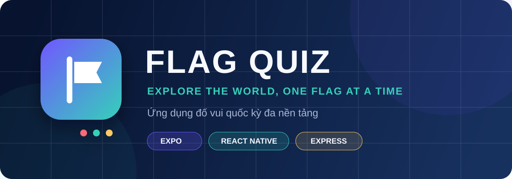
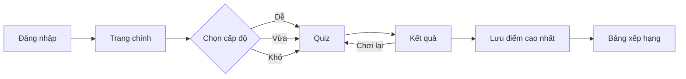
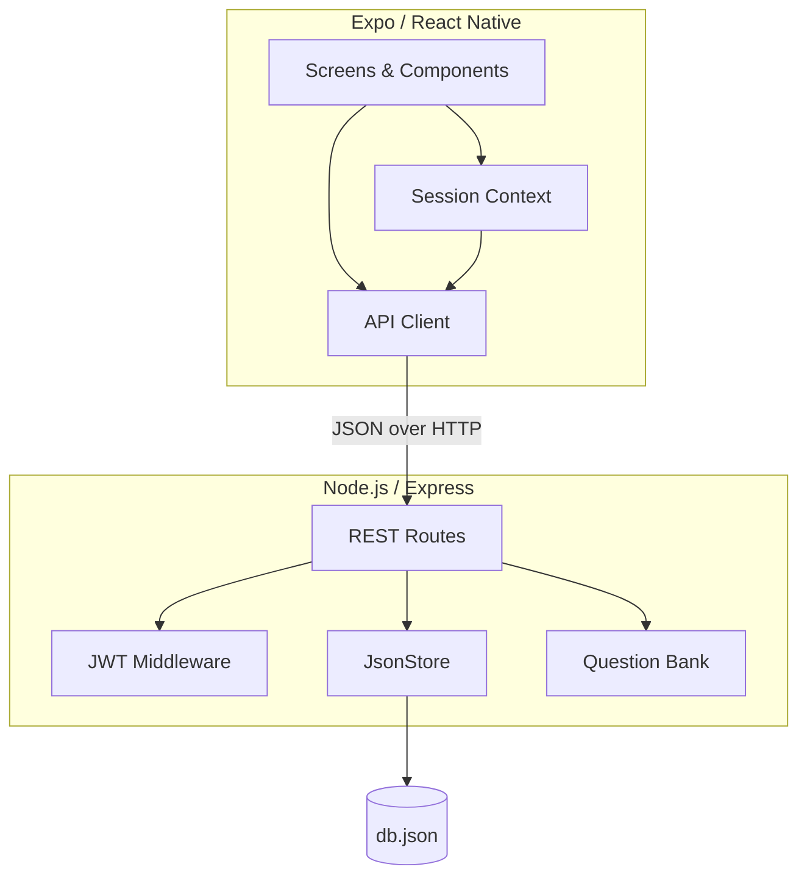

<div align="center">
  

  <br />

  [](https://expo.dev/)
  [](https://reactnative.dev/)
  [](https://nodejs.org/)
  [](#-quality-checks)
  [](#-quick-start)

  **Học địa lý qua những lá cờ — nhanh, vui và đầy thử thách.**

  [Tính năng](#-highlights) • [Chạy dự án](#-quick-start) • [Kiến trúc](#-architecture) • [API](#-api-reference)
</div>

---

## 🌍 About

**Flag Quiz** là ứng dụng đố vui quốc kỳ đa nền tảng, được xây dựng bằng Expo + React Native và Express. Người chơi có thể chọn độ khó, trả lời câu hỏi có giới hạn thời gian, tích lũy điểm theo tốc độ và cạnh tranh trên bảng xếp hạng.

Dự án cung cấp sẵn dữ liệu mẫu và kho lưu trữ JSON cho môi trường phát triển, vì vậy có thể chạy ngay mà không cần Firebase hay dịch vụ bên thứ ba.

## ✨ Highlights

| | Tính năng | Mô tả |
| :---: | --- | --- |
| 🔐 | **Authentication** | Đăng ký, đăng nhập với bcrypt, JWT và tự khôi phục phiên |
| 🧠 | **3 cấp độ** | Dễ, Vừa và Khó với ngân hàng 24 câu hỏi mẫu |
| ⏱️ | **Time challenge** | 20 giây mỗi câu, điểm thưởng dựa trên tốc độ trả lời |
| 🔀 | **Randomized quiz** | Xáo trộn cả câu hỏi lẫn đáp án ở mỗi lượt chơi |
| 🏆 | **Leaderboard** | Lưu điểm cao nhất riêng cho từng người chơi và cấp độ |
| 📱 | **Cross-platform** | Một codebase cho Android, iOS và Web |
| 🛡️ | **Defensive API** | Validate input, giới hạn body, auth middleware và lỗi nhất quán |
| 🧪 | **Quality gates** | Integration tests, ESLint, Expo Doctor và production bundle |

## 🎮 Game flow



### Scoring

Mỗi câu đúng nhận **100 điểm cơ bản** cộng **10 điểm cho mỗi giây còn lại**. Một câu có thể đạt tối đa 300 điểm; trả lời sai hoặc hết giờ nhận 0 điểm.

## 🚀 Quick start

### Requirements

- Node.js 20+
- npm 10+
- Expo Go hoặc Android/iOS emulator nếu chạy trên thiết bị di động

### 1. Install

```bash
git clone https://github.com/alexmerex/FlagQuiz.git
cd FlagQuiz
npm install
```

### 2. Start the API

```bash
npm run server
```

API mặc định chạy tại `http://localhost:3000/api`.

### 3. Start the app

Mở terminal thứ hai:

```bash
npm start
```

Nhấn `w` để mở Web, `a` cho Android hoặc quét QR bằng Expo Go.

> [!TIP]
> Tài khoản demo có sẵn: **`demo` / `demo1234`**

### Run on a physical phone

`localhost` trên điện thoại không trỏ về máy tính. Sao chép `.env.example` thành `.env` và dùng IP LAN của máy chạy server:

```env
EXPO_PUBLIC_API_URL=http://192.168.1.10:3000/api
```

Khởi động lại Expo sau khi đổi biến môi trường. Điện thoại và máy tính cần cùng mạng Wi-Fi; firewall phải cho phép cổng `3000`.

## 🏗 Architecture



<details>
<summary><strong>📁 Project structure</strong></summary>

```text
FlagQuiz/
├── App.js                     # Entry point và providers
├── src/
│   ├── components/            # UI components dùng chung
│   ├── config/                # API URL và cấu hình cấp độ
│   ├── context/               # Quản lý phiên đăng nhập
│   ├── navigation/            # Auth stack và app stack
│   ├── screens/               # Các màn hình ứng dụng
│   ├── services/              # HTTP client tập trung
│   └── theme/                 # Design tokens
└── server/
    ├── src/app.js             # Express app và routes
    ├── src/auth.js            # JWT middleware
    ├── src/store.js           # Kho dữ liệu JSON
    ├── src/questions.js       # Ngân hàng câu hỏi
    └── test/api.test.js       # Integration tests
```

</details>

## 🔌 API reference

| Method | Endpoint | Auth | Mô tả |
| --- | --- | :---: | --- |
| `GET` | `/api/health` | — | Kiểm tra trạng thái API |
| `POST` | `/api/auth/register` | — | Tạo tài khoản và nhận JWT |
| `POST` | `/api/auth/login` | — | Đăng nhập và nhận JWT |
| `GET` | `/api/questions?level=easy` | ✓ | Lấy bộ câu hỏi đã xáo trộn |
| `POST` | `/api/scores` | ✓ | Lưu điểm nếu là kỷ lục cá nhân |
| `GET` | `/api/leaderboard?level=easy` | — | Lấy bảng xếp hạng theo cấp độ |

Các cấp độ hợp lệ: `easy`, `normal`, `hard`.

## ⚙️ Configuration

| Biến môi trường | Mặc định | Mục đích |
| --- | --- | --- |
| `EXPO_PUBLIC_API_URL` | Theo platform | Địa chỉ API mà ứng dụng gọi tới |
| `PORT` | `3000` | Cổng HTTP của backend |
| `JWT_SECRET` | Development secret | Khóa ký JWT — bắt buộc thay khi deploy |
| `DATA_FILE` | `server/data/db.json` | Vị trí file dữ liệu cục bộ |

> [!IMPORTANT]
> `JsonStore` được thiết kế cho demo và môi trường phát triển một tiến trình. Khi triển khai production hoặc nhiều instance, hãy thay bằng PostgreSQL hay một dịch vụ database tương đương và đặt `JWT_SECRET` đủ mạnh.

## 🧪 Quality checks

```bash
# ESLint
npm run lint

# API integration tests
npm test

# Lint + tests + production web bundle
npm run check

# Kiểm tra tính tương thích Expo
npx expo-doctor
```

Trạng thái hiện tại: **3/3 tests passing**, **Expo Doctor 20/20**, production web bundle thành công.

## 🗺 Roadmap

- [ ] Mở rộng ngân hàng câu hỏi và thêm khu vực/châu lục
- [ ] Âm thanh, haptic feedback và animation chuyển câu
- [ ] Chế độ chơi offline
- [ ] PostgreSQL adapter cho production
- [ ] E2E tests trên Android, iOS và Web

## 🤝 Contributing

Issue và pull request luôn được chào đón. Trước khi gửi PR, vui lòng chạy:

```bash
npm run check
```

---

<div align="center">
  Made with 🌏 and React Native
</div>
